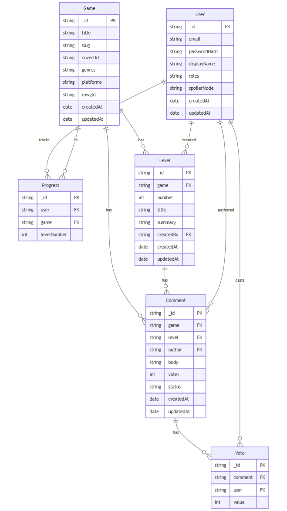

# 🎮 Game Progress Tracker

## 📌 Summary
Game Progress Tracker is a community-driven platform where users can explore games, levels, and leave comments with upvotes. It tracks player progress, ensures spoiler-safe interactions, and fosters discussions around different stages of games. Designed with scalability in mind, it separates games, levels, and user progress into structured models.


### 🔗 Browse It Live
Go Live: [http://gamersunite.surge.sh/](#)

---

## 🧩 ERD of the System Models
Entity Relationship Diagram (ERD) describing the structure between **Users, Games, Levels, progress and Comments**.  



---

## 🖼️ Screenshots from Browser

          


---

## 🚀 Getting Started

### 🧭 How to Go Through It
1. **Sign Up / Sign In**  
   - Register a new account or log in with existing credentials.

2. **Browse Games**  
   - Explore available games with their respective levels.

3. **Track Progress**  
   - Progress is saved per user with level completion.

4. **Comment & Vote**  
   - Add comments to levels, upvote/downvote discussions, and report when needed.

5. **Spoiler Handling**  
   - Preferences allow auto-hide, always-hide, or always-show spoilers.

---

## 🧰 Used Technologies

- HTML  
- CSS  
- React  
- Node.js  
- Express.js  
- MongoDB + Mongoose  
- JWT Authentication  
- bcrypt  
- Zod (validation)  
- slugify (clean URLs)  
- Git & GitHub  

---

## ✨ Features

- ✅ User registration & login (JWT auth)  
- ✅ Game and level browsing with structured models  
- ✅ User progress tracking per game  
- ✅ Comments with voting & reporting  
- ✅ Spoiler preferences (auto, hide, show)  

---

## 🧾 User Stories

### **User**
- As a user, I want to sign up and log in to save my progress.  
- As a user, I want to browse games and see their levels.  
- As a user, I want to comment on levels and vote on other comments.  
- As a user, I want spoiler handling to avoid game details I don’t want revealed.  


## 💡 Pseudo Code

```plaintext
IF user registers
    STORE user info in DB
    ISSUE JWT token for login

WHEN user browses games
    FETCH all games with levels
    DISPLAY levels with progress status

IF user comments on level
    VALIDATE comment
    SAVE with user + level reference
    ENABLE voting system

IF user sets spoiler prefs
    APPLY display rules for comments

IF admin views reports
    ACCESS moderation panel
    MANAGE visibility of comments


🛠️ Next Features (Future Enhancements)

📱 Mobile-first responsive UI

🔔 Notifications for replies or votes on comments

🧠 Recommendation system for similar games

📊 Leaderboards for completion rates

🧑‍⚖️ Add admin dashboard with analytics